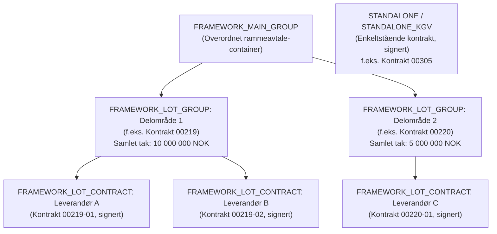

# Artifik External API: Utviklerguide og arkitekturreferanse

Denne guiden gir en helhetlig oversikt over integrasjonen mot **Artifik External API**, basert på offisielle retningslinjer fra `apidocs.artifik.no`, OpenAPI 3.0-spesifikasjonen ([`artifik-api-openapi-3.json`](file:///Users/kasper/Projects/Catenda/procurement-api/artifik-api-openapi-3.json)), og erfaringer fra implementasjonen i [`src/app/client.py`](file:///Users/kasper/Projects/Catenda/procurement-api/src/app/client.py).

Dokumentet er skrevet for utviklere som skal bygge, drifte eller vedlikeholde integrasjoner, protokollgeneratorer, MCP-verktøy og analyser mot Artifik.

---

## Innholdsfortegnelse

1. [Arkitektonisk oversikt og kildedata](#1-arkitektonisk-oversikt-og-kildedata)
2. [Autentisering og API-versjonering (v2 vs v3)](#2-autentisering-og-api-versjonering-v2-vs-v3)
3. [Datastrukturer og kontrakthierarki](#3-datastrukturer-og-kontrakthierarki)
4. [Verdier og summeringsregler](#4-verdier-og-summeringsregler)
5. [Internrapportering og egendefinerte felter (Custom Fields)](#5-internrapportering-og-egendefinerte-felter-custom-fields)
6. [Felter man IKKE skal stole på](#6-felter-man-ikke-skal-stole-på)
7. [Webhooks og hendelsesstyring](#7-webhooks-og-hendelsesstyring)
8. [Nøkkelverdier og norske termer](#8-nøkkelverdier-og-norske-termer)
9. [Sikkerhet og håndtering av hemmeligheter](#9-sikkerhet-og-håndtering-av-hemmeligheter)
10. [Referanser](#10-referanser)

---

## 1. Arkitektonisk oversikt og kildedata

Artifik fungerer som fagsystem for konkurransegjennomføring (KGV) og kontraktsoppfølging (KAV / KOF). Vår applikasjon konsumerer data fra Artifik gjennom tre hovedlag:

```
┌─────────────────────────────────────────────────────────────┐
│                    Artifik External API                     │
│                  (https://api.artifik.no)                   │
└──────────────┬──────────────────────────────┬───────────────┘
               │ OAuth2 (client_credentials)   │ Webhooks
               ▼                              ▼
┌──────────────────────────────┐       ┌──────────────────────┐
│        ArtifikClient         │       │  Webhook Receiver    │
│     (src/app/client.py)      │       │ (Signaturvalidering) │
└───────┬──────────────┬───────┘       └──────────────────────┘
        │              │
        ▼              ▼
┌──────────────┐ ┌──────────────┐ ┌───────────────────────────┐
│  Flask API   │ │   artifik    │ │   Protokollgenerator      │
│  Proxy & Web │ │     MCP      │ │   (src/protokoll/)        │
│ (/api/...)   │ │  (Cloud Run) │ │                           │
└───────┬──────┘ └──────────────┘ └───────────────────────────┘
        ▼
┌──────────────┐
│  SvelteKit   │
│   Frontend   │
└──────────────┘
```

- **Base URL:** `https://api.artifik.no`
- **OpenAPI-spesifikasjon:** Prosjektet har en oppdatert OpenAPI 3.0-spesifikasjon i [`artifik-api-openapi-3.json`](file:///Users/kasper/Projects/Catenda/procurement-api/artifik-api-openapi-3.json) med 33 stier og 181 DTO-skjemaer.
- **Klientsenter:** All direkte HTTP-kommunikasjon kapsles inn i [`ArtifikClient`](file:///Users/kasper/Projects/Catenda/procurement-api/src/app/client.py#L40).

---

## 2. Autentisering og API-versjonering (v2 vs v3)

### 2.1 OAuth2 Client Credentials Flow

Artifik External API benytter standard OAuth2 `client_credentials`-flyt. Autentisering gjøres mot endepunktet:

```http
POST /external/v2/token
Content-Type: application/json

{
  "grant_type": "client_credentials",
  "client_id": "<VENDOR_API_ID>",
  "client_secret": "<VENDOR_API_KEY>"
}
```

Respons:
```json
{
  "access_token": "eyJhbGciOi...",
  "token_type": "Bearer",
  "expires_in": 3600,
  "scope": "..."
}
```

#### Nøkkelregler for autentisering:
1. **Header:** Alle påfølgende kall må inkludere token i autorisasjonsheaderen:  
   `Authorization: Bearer <access_token>`
2. **Levetid og fornyelse:** `expires_in` oppgis i sekunder (normalt 3600 sekunder / 1 time). Klienten må automatisk fornye tokenet i god tid før det utløper (prosjektets `ArtifikClient` fornyer når det gjenstår under 60 sekunder).
3. **Miljøvariabler:** Nøkler injiseres via miljøvariablene `VENDOR_API_ID` og `VENDOR_API_KEY`. Verdier skal aldri hardkodes eller commites til git.

### 2.2 API-versjonering: v2 vs v3

API-et befinner seg i en overgangsfase mellom to versjoner:

| Egenskap | Versjon 2 (v2 — Dagens standard) | Versjon 3 (v3 — Ny standard) |
|---|---|---|
| **Formål** | Bakoverkompatibel produksjonsversjon | Modernisert og normalisert API |
| **Navnekonvensjon** | Hybrid miks av `snake_case` og `camelCase` (f.eks. `about_procurer`, `estimated_value`, `isCancelled`) | Konsekvent `camelCase` overalt (`aboutProcurer`, `estimatedValue`, `isCancelled`) |
| **Organisasjonsnummer** | Varierer mellom `national_id` og `orgNumber` | Standardisert til `orgNumber` overalt |
| **CPV-koder** | Flat streng-array (`cpv_codes`) med historiske skrivefeil (`aditional_cpv`) | Strukturert objekt: `{ mainCPV: string, additionalCPV?: string[] }` |
| **Listeberikelse** | Krever N+1 enkeltkall for å hente team og internrapportering | Støtter `includeTeam=true` og `includeInternalReporting=true` direkte på listeendepunkter |
| **Verifiseringsendepunkt** | Ingen dedikert endpoint | `GET /external/v3/whoami` returnerer organisasjon og rettigheter |

#### Aktivering av v3:
I henhold til spesifikasjonen kan v3 aktiveres på to måter:
1. Ved å kalle eksplisitte `/external/v3/*`-stier der de er definert.
2. Ved å sende HTTP-headeren `x-api-version: 3` i forespørselen mot `/external/*`.

> [!NOTE]
> Uten eksplisitt versjonsvalg returnerer Artifik API alltid v2-responser for å bevare bakoverkompatibilitet. Se [`docs/adr-005-artifik-v3-migration.md`](file:///Users/kasper/Projects/Catenda/procurement-api/docs/adr-005-artifik-v3-migration.md) for detaljert 4-trinns migreringsplan til v3.

---

## 3. Datastrukturer og kontrakthierarki

Artifik skiller mellom **strukturelle containere** og **juridisk bindende avtaler**. Ved rammeavtaler modelleres dette som et trelags hierarki:



### 3.1 Hierarkiets tre nivåer

1. **`FRAMEWORK_MAIN_GROUP` (Overordnet container):**
   - Representerer selve konkurransen eller paraply-avtalen når en anskaffelse har flere delområder.
   - Har ofte ingen egen økonomisk verdi (`value: null`) eller eget kontraktnummer.
   - Skal **aldri** behandles som en operativ avtale i kontraktslister.

2. **`FRAMEWORK_LOT_GROUP` (Delområdegruppe / Rammeavtale):**
   - Representerer det logiske rammeavtaleforholdet for et gitt delområde (lot).
   - **Bærer avtalenummeret** (f.eks. "00219") og den **samlede estimerte eller maksimale verdien** for delområdet.
   - Dette er noden som fungerer som forelder for de signerte leverandørkontraktene (`parentContractId`).

3. **`FRAMEWORK_LOT_CONTRACT` (Signerte delkontrakter per leverandør):**
   - De faktiske, juridisk bindende kontraktene inngått med de enkelte leverandørene på delområdet (f.eks. "00219-01", "00219-02").
   - Peker på sin `FRAMEWORK_LOT_GROUP` via `parentContractId`.
   - Inneholder leverandørinformasjon (`supplierOrg`, `supplierOrgNumber`), signaturstatus (`signingStatus`), signerte PAdES-dokumenter, og eventuelle avropsreferanser.

4. **Frittstående kontrakter (`STANDALONE` / `STANDALONE_KGV`):**
   - Enkeltkontrakter som ikke inngår i et rammeavtalehierarki.
   - Bærer eget avtalenummer, verdi og leverandør direkte på rotnivå.

### 3.2 Forskjellen på strukturelle containere og signerte kontrakter

| Egenskap | Strukturell container (`FRAMEWORK_MAIN_GROUP`, `FRAMEWORK_LOT_GROUP`) | Signert kontrakt (`FRAMEWORK_LOT_CONTRACT`, `STANDALONE`) |
|---|---|---|
| **Juridisk status** | Paraply / delområdeinndeling | Bindende avtale inngått med part |
| **Leverandørpart** | Ingen (eller liste over deltakere) | Spesifikk `supplierOrg` med `orgNumber` |
| **Signaturflyt** | Ingen direkte signatur | `signingStatus`, PAdES-fil, signatører |
| **Endringer og avvik** | Ingen | Støtter `amendments` (endringsavtaler) og `deviations` (KAV-avvik) |
| **Opsjoner** | Definerer rammebetingelser | `optionsJSON` spesifiserer forlengelser |

---

## 4. Verdier og summeringsregler

> [!CAUTION]
> **Advarsel mot naiv summering:** Verdier i Artifik registreres per nivå i hierarkiet. Hvis man summerer `value` ukritisk på tvers av poster i et kontraktsuttrekk, vil man telle samme økonomiske ramme to eller tre ganger!

### 4.1 Hvorfor verdier legges inn per nivå

I offentlige rammeavtaler med parallelle leverandører fastsettes ofte en **felles maksimal ramme** for delområdet, f.eks. 10 000 000 NOK:
- `FRAMEWORK_LOT_GROUP` har `value = 10 000 000`.
- De 3 underliggende `FRAMEWORK_LOT_CONTRACT`-postene settes ofte med samme nominelle verdi (10 000 000 NOK) fordi hver leverandør har rett til å motta avrop innenfor den felles rammen, eller de settes med et forventet delvolum.

Dersom en rapport summerer `value` for alle poster i databasen:
```
10 000 000 (LOT_GROUP) + 10 000 000 (Leverandør 1) + 10 000 000 (Leverandør 2) + 10 000 000 (Leverandør 3)
= 40 000 000 NOK (4x faktisk ramme!)
```

### 4.2 Autoritative summeringsregler

For å opprettholde finansiell integritet gjelder følgende to prinsipper i applikasjonen:

1. **Ved visning og oppsummering av rammeavtaler (KAV-portefølje):**
   - Ta avtaleverdien utelukkende fra `FRAMEWORK_LOT_GROUP` (eller `STANDALONE`).
   - Barnepostene (`FRAMEWORK_LOT_CONTRACT`) summeres **ikke** inn i avtalens totalverdi.

2. **Ved beregning av leverandørspesifikke porteføljer:**
   - Filtrer strengt på laveste operative kontraktsnivå:
     ```typescript
     contracts.filter(c => c.type === 'FRAMEWORK_LOT_CONTRACT' || c.type.startsWith('STANDALONE'))
     ```
   - Ekskluder **alltid** foreldrenoder (`FRAMEWORK_LOT_GROUP` og `FRAMEWORK_MAIN_GROUP`).

---

## 5. Internrapportering og egendefinerte felter (Custom Fields)

Virksomheter bruker Artifiks maler (SmartDoc templates) til å innhente egendefinerte opplysninger for anskaffelser og kontrakter (f.eks. prosjektnummer, bærekraftskrav, arkivreferanser eller saksbehandlerkoder). API-et tilbyr to metoder for å lese disse dataene:

### 5.1 Metode 1: Per post (`includeInternalReporting=true`)

Ved henting av enkeltanskaffelser eller kontrakter (eller listeendepunkter med støtte for berikelse) legges query-parameteren `includeInternalReporting=true` til.

Respons-objektet inneholder en liste `internalReporting`:

```json
{
  "id": 1858,
  "name": "Rammeavtale brannsikkerhet",
  "internalReporting": [
    {
      "nodeId": "8f2a1b94-3e11-4a8b-9d7a-4c92b217d1e8",
      "prompt": "Prosjektnummer i økonomisystemet",
      "type": "text",
      "value": "PRJ-2026-991",
      "valueText": "PRJ-2026-991"
    },
    {
      "nodeId": "1b3c9f20-94d2-4e55-81fa-76bb44e0192a",
      "prompt": "Inneholder anskaffelsen lærlingeklausul?",
      "type": "boolean",
      "value": true,
      "valueText": "Ja"
    }
  ]
}
```

#### Retningslinjer for parsing:
- **Bruk `nodeId` som stabil nøkkel:** Saksbehandlere kan endre ledeteksten (`prompt`) i malen, mens `nodeId` (UUID) er permanent.
- **`value` vs `valueText`:** Bruk `value` for programmatiske vurderinger (tall, boolske verdier, koder) og `valueText` for presentasjon i brukergrensesnitt.
- **Bruk hjelpefunksjonen:** Benytt [`parse_internal_reporting()`](file:///Users/kasper/Projects/Catenda/procurement-api/src/app/client.py#L499) i Python-klienten:
  ```python
  from app.client import parse_internal_reporting

  # Slå opp på nodeId
  fields_by_id = parse_internal_reporting(proc["internalReporting"], by="nodeId")
  prosjekt_nr = fields_by_id.get("8f2a1b94-3e11-4a8b-9d7a-4c92b217d1e8")
  ```

### 5.2 Metode 2: Som 2D-tabell (`/templates/{templateId}/responses`)

For eksport til rapporter, BI-verktøy eller store analyser på tvers av en hel organisasjon tilbyr Artifik et dedikert tabellendepunkt:

```http
GET /external/v2/organization/{organizationId}/templates/{templateId}/responses?entityType=procurement&page=1&pageSize=50
```

Endepunktet transformerer ustrukturerte svardata til en rektangulær matrise:

```json
{
  "templateId": 42,
  "templateName": "Obligatoriske rapporteringsfelter 2026",
  "columns": [
    { "id": "8f2a1b94-...", "name": "Prosjektnummer", "type": "text" },
    { "id": "1b3c9f20-...", "name": "Lærlingeklausul", "type": "boolean" }
  ],
  "rows": [
    {
      "entityId": 1858,
      "entityName": "Rammeavtale brannsikkerhet",
      "organizationId": "oslobygg",
      "values": {
        "8f2a1b94-...": "PRJ-2026-991",
        "1b3c9f20-...": "Ja"
      }
    }
  ],
  "page": 1,
  "pageSize": 50,
  "totalCount": 120
}
```

Dette fjerner behovet for å iterere over hundrevis av anskaffelser og slå sammen enkeltfelter manuelt.

---

## 6. Felter man IKKE skal stole på

Artifiks datamodell inneholder enkelte felter som er beregnet for internt bruk i Artifiks eget webgrensesnitt. Disse feltene må **aldri** brukes som kilde for forretningslogikk eller protokollgenerering:

1. **`protocolJSON`:**
   - **Hva det er:** Upublisert, intern tilstand fra Artifiks innebygde protokoll-editor i nettleseren.
   - **Hvorfor unngå:** Skjemaet er uoffisielt, endres uten forvarsel ved frontend-oppdateringer hos Artifik, og mangler DTO-validering i API-et.
   - **Hva du skal bruke i stedet:** Les anskaffelsens offisielle rotfelter (`procedure`, `regulation`, `threshold`, `estimated_value`) og aktivitetsloggen (`/activities`).

2. **`draftProgressJSON`:**
   - **Hva det er:** Midlertidig progresjons- og huskeliste for saksbehandler i Artifiks veileder.
   - **Hvorfor unngå:** Inneholder ikke juridisk gyldige data, og felter slettes eller nullstilles vilkårlig.

3. **`smartDocResponse` / `smartDocResponses` (rå docJSON):**
   - **Hva det er:** Serialiserte dokumenttrær fra Artifiks dokumentskriver.
   - **Hvorfor utvise stor forsiktighet:** Kun en forsvinnende liten andel av anskaffelser (2 av 150 undersøkte) har konsistente data her. De fleste anskaffelser har tomme eller avvikende skjemaformater.
   - **Hva du skal bruke i stedet:** Bruk standardiserte `internalReporting`-felter (se kapittel 5).

4. **`optionsJSON`:**
   - **OBS:** Kan returneres enten som en rå JSON-streng (`"{\"prolongPeriods\": [1, 1]}"`) eller som et allerede parset objekt/array. Kode som leser opsjoner må alltid sjekke typen og håndtere begge formater resilient.

---

## 7. Webhooks og hendelsesstyring

Webhooks gjør det mulig å reagere umiddelbart på hendelser i Artifik uten ressurskrevende polling.

### 7.1 Registrering

Webhooks opprettes via `POST /external/v2/webhooks`:

```json
{
  "callbackURL": "https://mitt-system.no/api/webhooks/artifik",
  "actionList": [
    "SUBMIT_BID",
    "OPEN_BIDS",
    "AWARDING_PARTICIPANTS",
    "CONTRACT_SIGNED"
  ]
}
```

> [!IMPORTANT]
> **Ingen wildcard:** Alle ønskede hendelsestyper må spesifiseres eksplisitt i `actionList`. Wildcard (`*`) er ikke tillatt i Artifik API og vil bli avvist.

### 7.2 Sikkerhet og signaturverifisering

Artifik signerer hver webhook-forespørsel for å forhindre manipulasjon og spoofing. Mottakere må verifisere signaturen før hendelsen behandles.

#### Signaturformel:
Signaturen genereres som SHA-256-hash av sammenslåingen av `messageId` og hashet av hemmeligheten:

$$\text{signature} = \text{sha256}\Big(\text{messageId} + \text{sha256}(\text{oauthSecret})\Big)$$

I Python implementeres verifiseringen slik:

```python
import hashlib
import hmac

def verify_artifik_webhook(message_id: str, client_secret: str, received_signature: str) -> bool:
    """Verifiser at innkommende webhook kommer fra Artifik."""
    secret_hash = hashlib.sha256(client_secret.encode("utf-8")).hexdigest()
    combined = f"{message_id}{secret_hash}".encode("utf-8")
    expected_signature = hashlib.sha256(combined).hexdigest()
    
    # Bruk hmac.compare_digest for å beskytte mot timing attacks
    return hmac.compare_digest(expected_signature, received_signature)
```

Headerne som følger med webhook-kallet er:
- `x-artifik-message-id`: Unik meldingsidentifikator.
- `x-artifik-signature`: Den beregnede SHA-256-signaturen.

### 7.3 Sentrale hendelsestyper (Action Types)

| Kategori | Action | Betydning og protokollrelevans |
|---|---|---|
| **Kunngjøring** | `PUBLISH_TO_DOFFIN` | Kunngjøring er sendt til Doffin/TED. |
| | `DOFFIN_NOTICE_STATUS_PUBLISHED` | Bekreftelse fra Doffin med referansenummer (`ngoj`, `publicationId`). |
| | `PUBLISH_CHANGE_PROCUREMENT` | Kunngjort endring med endringslogg (`__old` / `__new`). |
| **Kvalifikasjon** | `ASK_TO_QUALIFY` | Leverandør har levert forespørsel om å delta. |
| | `OPEN_QUALIFICATIONS` | Tidspunkt for åpning av kvalifikasjonssøknader. |
| | `QUALIFYING_PARTICIPANTS` | Liste over kvalifiserte og utvalgte leverandører. |
| **Tilbud** | `SUBMIT_BID` | Leverandør har levert tilbud. |
| | `OPEN_BIDS` | Offisiell åpning av innkomne tilbud. |
| | `WITHDRAW_PARTICIPATION` | Leverandør har trukket sitt tilbud. |
| **Avvisning & Tildeling** | `REJECT_PARTICIPATION` | Avvisning av leverandør eller tilbud. (*Merk: `organization` kan være tom, se [Avvisningsbegrensninger](file:///Users/kasper/Projects/Catenda/procurement-api/docs/protokoll-datagrunnlag.md#avvisning--api-begrensninger)*). |
| | `AWARDING_PARTICIPANTS` | Tildelingsbeslutning med referanse til vinnende tilbud (`tendersIds`). |
| **Dialog & Avklaring** | `PUBLISH_ADDITIONAL_INFORMATION` | Konkurransegrunnlag oppdatert med tilleggsinformasjon. |
| | `PUBLISH_Q8A` | Spørsmål og svar (Q&A) publisert. |
| | `CONVERSATION_MARKED_COMPLETED` | Meldingsdialog med leverandør fullført. Etter tilbudsfrist indikerer dette ofte ettersending/avklaring (§ 23-5). |
| **Kontrakt (KAV)** | `CONTRACT_CREATED` | Kontrakt opprettet i KAV. |
| | `CONTRACT_SIGNED` | Kontrakt signert av alle parter. |
| | `DEVIATION_REPORTED` | Nytt avvik registrert på en kontrakt. |

---

## 8. Nøkkelverdier og norske termer

Artifik API benytter engelske nøkkelord for prosedyrer, forskrifter og terskelverdier. Vår applikasjon mapper disse systematisk til offisielle norske fagtermer via [`src/eforms_labels.py`](file:///Users/kasper/Projects/Catenda/procurement-api/src/eforms_labels.py).

### 8.1 Prosedyretyper (`procedure`)

| Artifik API-kode | eForms-kode | Norsk term (Del III / EØS) | Norsk term (Del II / Nasjonal) | Kortform |
|---|---|---|---|---|
| `Open` | `open` | Åpen anbudskonkurranse | Åpen tilbudskonkurranse | Åpen |
| `Limited` | `restricted` | Begrenset anbudskonkurranse | Begrenset tilbudskonkurranse | Begrenset |
| `Competitive negotiated` | `neg-w-call` | Konkurranse med forhandling | Konkurranse med forhandling | Forhandling |
| `Competitive dialogue` | `comp-dial` | Konkurransepreget dialog | Konkurransepreget dialog | Dialog |
| `Innovation partnership` | `innovation` | Innovasjonspartnerskap | Innovasjonspartnerskap | Innovasjon |
| `Negotiated without publication` | `neg-wo-call` | Forhandling uten forutgående kunngjøring | Forhandling uten forutgående kunngjøring | Uten kunngj. |
| `Direct award` | `oth-single` | Direkte anskaffelse | Direkte anskaffelse | Direkte |
| `Simple` | `simple` | Minikonkurranse (rammeavtale) | Minikonkurranse (rammeavtale) | Minikonk. |

### 8.2 Regelverk og forskrifter (`regulation`)

| API-kode | Forskrift | Typisk virkeområde |
|---|---|---|
| `FOA` | **Forskrift om offentlige anskaffelser** (anskaffelsesforskriften) | Klassisk offentlig sektor (kommuner, fylker, statlige etater). |
| `FOR` | **Forsyningsforskriften** | Virksomheter innen vann-, energi-, transport- og posttjenester. |
| `FOS` | **Forsvars- og sikkerhetsforskriften** | Forsvarsmateriell, militære formål og gradert sikkerhet. |
| `KONSESJON` | **Konsesjonskontraktforskriften** | Tildeling av tjeneste- og byggkonsesjoner. |

#### Inndeling i FOA:
- **Del I (Alminnelige prinsipper):** Gjelder for alle anskaffelser over 100 000 NOK ekskl. mva.
- **Del II (Nasjonale anskaffelser):** Anskaffelser med anslått verdi mellom 1,3 millioner NOK ekskl. mva. og EØS-terskelverdi.
- **Del III (EØS-anskaffelser):** Anskaffelser over EØS-terskelverdi (strenge formkrav, kunngjøring i TED/Doffin, anskaffelsesprotokoll etter § 25-5).

### 8.3 Terskelverdier (`threshold`)

| API-kode | Terskelnivå | Norsk beskrivelse |
|---|---|---|
| `below_national_threshold` | Under nasjonal terskel | Under 1,3 mill. NOK (FOA Del I) |
| `national_threshold` | Nasjonal terskel | Mellom 1,3 mill. NOK og EØS-terskel (FOA Del II) |
| `below_eea_threshold_value` | Under EØS-terskel | Nasjonal anskaffelse (FOA Del II) |
| `over_eea_threshold_value` | Over EØS-terskel | EØS-terskelverdi overskredet (FOA Del III) |

### 8.4 Kontraktens art (`contractCategory`)

- `SERVICES`: Tjenestekontrakt
- `SUPPLIES`: Varekontrakt
- `WORKS`: Bygg- og anleggskontrakt
- `goods_and_services`: Kombinert vare- og tjenestekontrakt

---

## 9. Sikkerhet og håndtering av hemmeligheter

Prosjektet har en ufravikelig sikkerhetsregel fastsatt i [`AGENTS.md`](file:///Users/kasper/Projects/Catenda/procurement-api/AGENTS.md):

> **Agenter skal aldri hente, skrive ut eller lese secret-verdier fra GCP Secret Manager eller terminalen.**

- `VENDOR_API_ID` og `VENDOR_API_KEY` injiseres i miljøet av oppstartsskriptene (`./dev.sh`, `./deploy.sh`, `./deploy-web.sh`).
- Hemmeligheter skal aldri logges, legges i filer på disk (`.env`, `tmp.txt`), commites eller sendes som argumenter i meldinger eller verktøykall.
- All testing og klientkall benytter hemmelighetene transparent via standard miljøvariabler.

---

## 10. Referanser

- [ADR-005: Migreringsstrategi og arkitektur for Artifik External API v3](file:///Users/kasper/Projects/Catenda/procurement-api/docs/adr-005-artifik-v3-migration.md)
- [ADR-001: Remote MCP Server](file:///Users/kasper/Projects/Catenda/procurement-api/docs/adr-001-remote-mcp-server.md)
- [ADR-002: Protokollgenerator arkitektur](file:///Users/kasper/Projects/Catenda/procurement-api/docs/adr-002-protokollgenerator.md)
- [Protokoll — datagrunnlag fra API](file:///Users/kasper/Projects/Catenda/procurement-api/docs/protokoll-datagrunnlag.md)
- [ArtifikClient kildekode](file:///Users/kasper/Projects/Catenda/procurement-api/src/app/client.py)
- [Artifik OpenAPI 3.0-spesifikasjon](file:///Users/kasper/Projects/Catenda/procurement-api/artifik-api-openapi-3.json)
- [eForms- og Artifik-kodeoversettelser](file:///Users/kasper/Projects/Catenda/procurement-api/src/eforms_labels.py)
