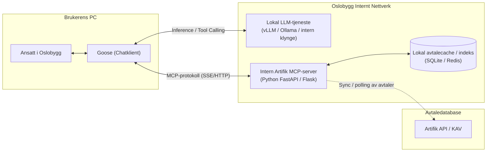
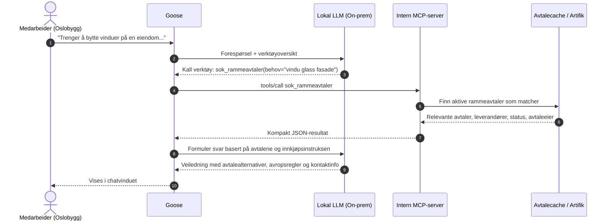

# Løsningsforslag: Rammeavtale-assistent for Oslobygg KF

**Dato:** 2026-09-23  
**Status:** Forslag / Konsept  
**Målgruppe:** Oslobygg KF (Innkjøp, IT/Digitalisering, Prosjektledere og Forvaltere)  
**Klient:** Goose (AI Agent)  
**Infrastruktur:** 100 % internt driftet (On-premise / Interne servere)

---

## 1. Bakgrunn og formål

Medarbeidere i Oslobygg har jevnlig behov for å bestille varer og håndverkertjenester (f.eks. utskifting av vinduer, elektroarbeider, konsulenttjenester). For å sikre etterlevelse av lov og forskrift om offentlige anskaffelser (FOA) og foretakets egne innkjøpsregler, skal eksisterende rammeavtaler alltid benyttes dersom slike finnes.

I dag må ansatte enten kjenne til avtalene på forhånd, lete manuelt i KAV/Artifik eller kontakte Innkjøp. 

**Mål:** Gi medarbeiderne en intern KI-assistent i **Goose** som kan svare på henvendelser som:
> *«Jeg trenger å gjennomføre arbeider for å bytte vinduer på en skole ...»*  
> Svar: *«Da kan du velge mellom Rammeavtale A (Glass/Fasade) og Rammeavtale B (Tømrer). For beløp under 150 000 kr gjelder direkteavrop. Kontakt Innkjøp for mer hjelp.»*

---

## 2. Arkitektur og dataflyt

All informasjonsbehandling skjer innenfor Oslobyggs lukkede nettverk. Verken avtaledata, prosjektnavn eller henvendelser sendes til eksterne skytjenester.



### Sekvensdiagram: Henvendelse fra ansatt



---

## 3. Komponenter

| Komponent | Teknisk løsning | Rolle |
|-----------|-----------------|-------|
| **Chatvindu (Klient)** | Goose (Block/Square) | Kjører lokalt på den ansattes PC. Kobler sammen bruker, lokal modell og interne MCP-verktøy. |
| **KI / Inferens** | Lokal modellklynge (vLLM / Ollama / Llama.cpp) | Resonnerer over brukerens henvendelse, foretar verktøykall og formulerer svar på norsk. |
| **MCP-server** | `src/artifik_mcp` (dette repoet) | Kjører på intern app-server i Oslobygg. Eksponerer spissede verktøy mot Artifik og lokal avtalecache. |
| **Kildedata** | Artifik API / KAV | Kilden for kontrakter, leverandører, rammeavtaler, utløpsdatoer og opsjoner. |

---

## 4. MCP-verktøydesign for lokale modeller

Lokale språkmodeller har ofte lavere minnekapasitet og mindre kontekstvindu enn store skymodeller. Derfor bør ikke MCP-serveren returnere rått API-innhold (`list_contracts` med 500 JSON-objekter).

Vi etablerer to spesialiserte verktøy:

### A. `sok_rammeavtaler(behov, kategori=None)`
Gjør et filtrert oppslag i aktive rammeavtaler (`type == FRAMEWORK_LOT_GROUP` eller enkeltstående avtaler som ikke er utløpt).

**Eksempel på komprimert JSON returnert til modellen:**
```json
[
  {
    "avtale_id": 1042,
    "avtalenummer": "2024-042",
    "navn": "Rammeavtale Bygningsmessige arbeider – Glass og fasade",
    "status": "AKTIV",
    "gyldig_til": "2027-12-31",
    "leverandorer": ["Glass & Fasade AS", "Oslo Vindu & Montasje AS"],
    "avtaleansvarlig": "Kari Nordmann (Seksjon Byggherre)",
    "avropsmekanisme": "Direkteavrop inntil 150 000 NOK (rangert). Minikonkurranse over 150 000 NOK."
  }
]
```

### B. `hent_avtaledetaljer(avtale_id)`
Henter utdypende detaljer dersom brukeren har oppfølgingsspørsmål (f.eks. kravspesifikasjon, vedlegg, timepriser eller nøyaktige kontaktpersoner).

---

## 5. Goose-konfigurasjon og systeminstruks

### Goose konfigurasjon (`~/.config/goose/config.yaml`)

```yaml
# Lokal LLM-inferens
models:
  default:
    provider: openai
    base_url: http://lokal-llm.oslobygg.privat/v1
    model_name: meta-llama-3.1-70b-instruct

# Interne MCP-utvidelser
extensions:
  oslobygg-avtaler:
    type: sse
    uri: http://artifik-mcp.oslobygg.privat/mcp
```

### Systeminstruks (Guardrails / Innkjøpsregler i Goose)

```text
Du er Oslobyggs interne innkjøps- og avtaleveileder.
Oppgaven din er å hjelpe ansatte med å finne og benytte riktige rammeavtaler for sine behov.

Følg alltid disse reglene:
1. Sjekk alltid om det finnes en aktiv rammeavtale før du foreslår noe annet.
2. Identifiser relevante fagområder basert på brukerens beskrivelse (f.eks. vindu -> glassmester / fasade / tømrer).
3. Gjør brukeren oppmerksom på avtaleperioden og om avtalen krever direkteavrop eller minikonkurranse.
4. Oppgi alltid navnet på avtaleansvarlig i Oslobygg.
5. Avslutt alltid med å henvise til Seksjon Innkjøp (innkjop@oslobygg.no) for videre veiledning eller bistand med avrop.
```

---

## 6. Gevinster for Oslobygg

1. **Etterlevelse og lojalitet:** Sikrer at foretakets inngåtte rammeavtaler faktisk brukes, og reduserer risiko for ulovlige direkteanskaffelser.
2. **Sikkerhet og personvern:** 100 % lokal kjøring garanterer at ingen data lekker til tredjeparter.
3. **Brukervennlighet:** De ansatte slipper å navigere i komplekse avtaleregistre og kan henvende seg på naturlig fagspråk i sin daglige arbeidsflate (Goose).
4. **Avlastning av innkjøpsavdelingen:** Rutinehenvendelser om «hvilken avtale har vi for X?» besvares umiddelbart.
