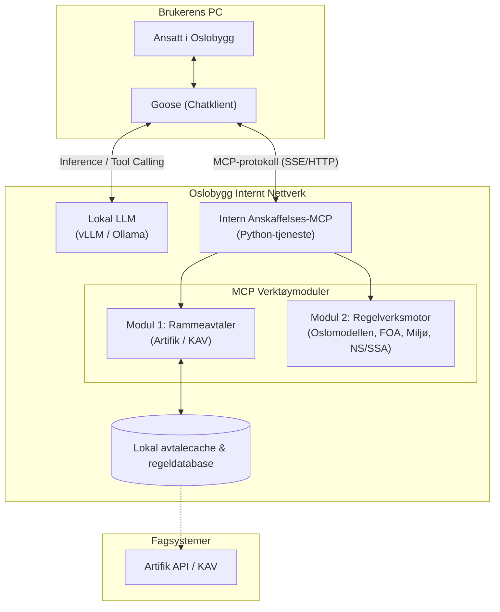
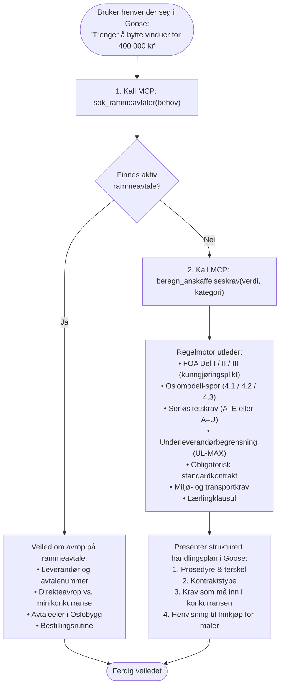

# Konseptskisse: Helhetlig anskaffelses- og regelverksassistent for Oslobygg KF

**Dato:** 2026-09-23  
**Status:** Forslag / Konsept  
**Målgruppe:** Oslobygg KF (Innkjøp, Prosjektledere, Eiendomsforvaltere, IT/Digitalisering)  
**Klient:** Goose (AI Agent på brukerens PC)  
**Infrastruktur:** 100 % internt driftet (On-premise / Interne servere)  
**Kilder:** `procurement-api` (Artifik/KAV) og `Anskaffelsesagent` (Oslomodellen, FOA, Miljøkrav)

---

## 1. Bakgrunn og visjon

Når en medarbeider i Oslobygg skal bestille en vare, tjeneste eller håndverkerarbeid, står de overfor to kjerneoppgaver:
1. **Primærsjekk:** Finnes det en gyldig **rammeavtale** som skal benyttes?
2. **Sekundærsjekk:** Hvis rammeavtale *ikke* finnes (eller taket er nådd / behovet faller utenfor), må det gjennomføres en **enkeltanskaffelse**. Da utløses et omfattende og komplekst regelverk:
   - Lov og forskrift om offentlige anskaffelser (FOA-terskelverdier og prosedyre).
   - **Oslomodellen** (seriøsitetskrav A–U, underleverandørbegrensninger, utvidet skatteattest, lærlingekrav).
   - **Obligatoriske standardkontrakter** (Byrådssak 1031/23 – NS-kontrakter, Oslo-kontraktene, SSA).
   - **Klima- og miljøkrav** (Byrådssak 1014/25 for byggeplasser og 1004/25 for transport).
   - **Reserverte kontrakter** (Oslo-instruksen pkt. 8 for arbeidsmarkedsbedrifter).

I dag er denne logikken spredt:
- Avtaler og oppfølging ligger i Artifik/KAV (frontend i `procurement-api`).
- Regelberegningen er kodet i `Anskaffelsesagent` (kjører i dag i Svelte-frontend på Vercel).

**Visjonen:** Samle begge kapabiliteter bak én felles **intern MCP-server**. Medarbeideren stiller ett spørsmål på naturlig fagspråk i **Goose**, og KI-assistenten orkestrerer hele sjekken deterministisk og trygt.

---

## 2. Helhetlig arkitektur og informasjonsflyt

All dataflyt og modellkjøring foregår innenfor Oslobyggs lukkede nettverk.



---

## 3. Beslutningstre i agenten

Når brukeren henvender seg til Goose, følger agenten en streng to-trinns innkjøpsfaglig logikk:



---

## 4. Spesifikasjon av nye MCP-verktøy

For å avlaste den lokale språkmodellen for tunge beregninger og eliminere risiko for hallusinasjoner på terskler, eksponeres to dedikerte verktøy fra regelmotoren:

### Verktøy 1: `beregn_anskaffelseskrav`

Tar inn grunnlagsdata om oppdraget og returnerer en deterministisk, strukturert fasit.

```python
@mcp_tool(
    description="Beregn gjeldende terskelverdier, FOA-prosedyre, Oslomodell-spor, standardkontrakter og miljøkrav for en anskaffelse."
)
def beregn_anskaffelseskrav(
    verdi: int,
    kategori: str,                # "bygg" | "anlegg" | "tjeneste" | "vare" | "renhold"
    underkategori: str | None = None,  # f.eks. "vedlikehold", "ikt", "catering"
    varighet_mnd: int = 1,
    risiko_akrim: str = "lav",     # "ingen" | "lav" | "moderat" | "høy"
    risiko_sosial_dumping: str = "lav",
    har_massetransport: bool = False,
    har_tung_transport: bool = False,
) -> dict:
    ...
```

#### Eksempel på JSON-respons til modellen:
```json
{
  "grunnlag": {
    "verdi": 400000,
    "kategori": "bygg",
    "underkategori": "vedlikehold"
  },
  "prosedyre": {
    "del": "del_1",
    "label": "FOA Del I",
    "kunngjoring_doffin": false,
    "terskel_neste": 1300000,
    "veiledning": "Ingen kunngjøringsplikt på Doffin. Oslobyggs instruks krever tilbud fra minst 3 leverandører."
  },
  "standardkontrakt": {
    "anbefalt": "Standardkontrakt for Oslo kommunes kjøp av håndverkertjenester",
    "alternativ": "NS 8406 Forenklet norsk bygg- og anleggskontrakt",
    "hjemmel": "Byrådssak 1031/23"
  },
  "oslomodellen": {
    "spor": "4.1",
    "beskrivelse": "Bygg/anlegg/tjeneste 100 000–500 000 kr",
    "basiskrav": ["A", "B", "C", "D", "E"],
    "risikobaserte_krav_utlost": false,
    "skatteattest": null,
    "underleverandor_maks_ledd": 2,
    "underleverandor_tekst": "Maks to ledd underleverandører i vertikal kjede (pkt. 5.1c)",
    "aktsomhetsniva": "generell"
  },
  "laerlinger": {
    "utlost": false,
    "grunn": "Under terskelverdi på 1 300 000 kr (pkt. 6)"
  },
  "miljokrav": {
    "spor": "Bygg og anlegg (Byrådssak 1014/25)",
    "hovedkrav": "Utslippsfrie anleggsmaskiner og oppvarming/tørking på byggeplass",
    "transportkrav_utlost": false
  },
  "reservert_kontrakt": false
}
```

### Verktøy 2: `hent_kravtekst(krav_kode)`
Gir ordlyden i de spesifikke seriøsitetskravene (f.eks. Krav A for lønns- og arbeidsvilkår, Krav H for underleverandører, eller Krav T for skatt) slik at agenten kan lime dem rett inn i et konkurransegrunnlag eller avtaleutkast.

---

## 5. Brukerscenarier i Goose

### Scenario A: Rammeavtale finnes (Standard avrop)

```text
Bruker: 
«Vi har oppdaget råte i vinduskarmene på Rommen skole. Det må byttes ca. 8 vinduer, 
estimert til 180 000 kr. Hva gjør jeg?»

Goose (kaller sok_rammeavtaler):
«1. Rammeavtale funnet:
   Oslobygg har en aktiv rammeavtale for Glass- og fasadearbeider (Avtalenr. 2024-042).
   • Leverandør: Glass & Fasade AS
   • Gyldig til: 31.12.2027

Avropsregler:
• For beløp inntil 150 000 kr gjelder direkteavrop.
• Siden dette oppdraget er estimert til 180 000 kr, må det gjennomføres en forenklet 
  minikonkurranse mellom de rangerte leverandørene på rammeavtalen.

Kontakt avtaleansvarlig Ola Nordmann (Seksjon Byggherre) eller Seksjon Innkjøp for mal 
til minikonkurranse.»
```

### Scenario B: Rammeavtale finnes IKKE (Egen anskaffelse etter Oslomodellen)

```text
Bruker: 
«Vi trenger spesialtilpassede lyddempingsglass til et musikkrom på en videregående skole. 
Verdi er ca. 750 000 kr. Rammeavtalen dekker ikke disse spesialglassene.»

Goose (kaller sok_rammeavtaler -> ingen treff, kaller deretter beregn_anskaffelseskrav):
«Siden rammeavtalen ikke dekker spesialglass, må det gjennomføres en enkeltanskaffelse.
Her er reglene og kravene som utløses for et bygg-/håndverkeroppdrag på 750 000 kr i Oslobygg:

1. Prosedyre (FOA):
   • FOA Del I gjelder (oppdraget er under nasjonal terskelverdi på 1,3 mill kr).
   • Det er ikke plikt til å kunngjøre på Doffin, men Oslobyggs interne retningslinjer krever at 
     du innhenter skriftlige tilbud fra minst tre leverandører.

2. Standardkontrakt (Byrådssak 1031/23):
   • Du skal benytte NS 8406 (forenklet bygg/anleggskontrakt) eller Oslo kommunes 
     standardkontrakt for håndverkertjenester.

3. Oslomodellen – Seriøsitetskrav (Spor 4.2):
   • Siden oppdraget er innen bygg og over 500 000 kr, utløses Oslomodellens fulle kravliste (Krav A–U).
   • Krav til lønns- og arbeidsvilkår, lærlinger, elektronisk betaling og revisjonsadgang må vedlegges.
   • Utvidet skatteattest må innhentes fra valgt leverandør før kontraktsinngåelse.
   • Maksimalt to ledd underleverandører i kjeden.

4. Klima og miljø (Byrådssak 1014/25):
   • Krav om fossilfri/utslippsfri transport og montering.

Vil du at jeg skal generere en oppsummering eller et utkast til kravvedlegg du kan sende til Innkjøp?»
```

---

## 6. Realisering og integrasjon i koden

Dette repoet (`procurement-api`) har allerede infrastrukturen for MCP. Å innlemme logikken fra `Anskaffelsesagent` gjøres i tre enkle trinn:

1. **Porting av beregningslogikk til Python:**
   - Overføre funksjonene fra `Anskaffelsesagent/frontend-svelte/src/lib/logic/` (`oslomodel.ts`, `miljokrav.ts`, `standardkontrakter.ts`, `seriositetskrav.ts`) til rene Python-moduler under `src/app/rules/`.
   - Ettersom kildekoden allerede er skrevet som «pure functions without dependencies», er oversettelsen til Python 3.12 direkte og uten bibliotekavhengigheter.
2. **Dekorere med `@mcp_tool`:**
   - Registrere `beregn_anskaffelseskrav` og `hent_kravtekst` på `ArtifikClient` eller en egen `RulesClient` i `src/artifik_mcp/server.py`.
3. **Automatisert testdekning:**
   - Gjenbruke testcasene fra `oslomodel.test.ts` og `miljokrav.test.ts` som pytest-tester i `tests/test_rules_mcp.py`.

---

## 7. Gevinster for Oslobygg

| Område | Uten MCP-assistent | Med samlet MCP-assistent i Goose |
|---|---|---|
| **Rammeavtalelojalitet** | Ansatte bestiller ofte utenom avtale fordi de ikke finner den | Avtaler foreslås automatisk først |
| **Kravetterlevelse** | Fare for å glemme Oslomodellens særkrav eller feil standardkontrakt | Deterministisk fasit med riktige kravtekster og Byrådssak-hjemler |
| **Tidsbruk** | Manuelle oppslag i KAV, intranett og henvendelser til Innkjøp | Svar på 3 sekunder direkte i Goose |
| **Datasikkerhet** | Risiko for at ansatte limer prosjekter inn i eksterne skymodeller | 100 % lokal prosessering på Oslobyggs interne servere |
